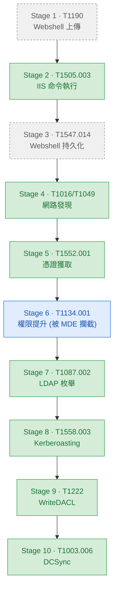

# chain-01-web-to-ad

## 項目概述 

主要從DMZ webshell到AD域控權限的完整攻擊鏈。

## 攻擊流程

DMZ webshell → 憑證獲取 → LDAP 大規模枚舉 → kerberoast → WriteDACL → DCSync

## 攻擊鏈流程圖
 

 
**圖例:**
- 🟢 **已驗證**(綠色) — 攻擊執行 + Sentinel 命中 KQL 規則
- 🔘 **概念設計**(灰色虛線) — 攻擊成功,偵測邏輯待補
- 🔵 **被攔截**(藍色) — EDR 阻擋攻擊
---

## 項目成果

## 項目成果
 
| 階段 | 技術 | 狀態 | 說明 | KQL 規則 |
|---|---|---|---|---|
| Stage 1 | T1190 - Webshell 上傳 | 🔘 概念 | Webshell 上傳到 DMZ-web | — |
| Stage 2 | T1505.003 - IIS 命令執行 | ✅ 驗證 | w3wp.exe 運行系統命令 | IIS - w3wp - Spawning Suspicious Child Process |
| Stage 3 | T1547.014 - Webshell 持久化 | 🔘 概念 | Webshell 多層部署 | — |
| Stage 4 | T1016/T1049 - 網路發現 | ✅ 驗證 | ipconfig/net view/tasklist 探測內網 | IIS - w3wp - Network Discovery Command Execution |
| Stage 5 | T1552.001 - 憑證獲取 | ✅ 驗證 | Findstr 掃描腳本/設定檔中的明碼密碼 | IIS - w3wp - Credential Scanning via findstr |
| Stage 6 | T1134.001 - 權限提升 | 🔵 攔截 | GodPotato/Potato 家族被 MDE 阻擋 | — |
| Stage 7 | T1087.002 - LDAP 枚舉 | ✅ 驗證 | GetADUsers/GetADComputers/GetUserSPNs 列舉 | AD - LDAP - Enumeration Tool Execution |
| Stage 8 | T1558.003 - Kerberoasting | ✅ 驗證 | 請求服務票證,獲得 3 張 RC4 加密 TGS | AD - KDC - RC4 Encrypted TGS Request Detected AD - KDC - Kerberoasting TGS Requests |
| Stage 9 | T1222 - WriteDACL | ✅ 驗證 | 利用 Backup-Admins 過度授權,賦予 svc_backup 複寫權 | AD - DomainObject - WRITE_DAC Permission Modification |
| Stage 10 | T1003.006 - DCSync | ✅ 驗證 | 用 svc_backup 執行 DCSync,竊取網域雜湊 | AD - DomainObject - Directory Replication by Non-DC Account |

## 未覆蓋階段

以下階段目前無 KQL 規則:

**Stage 1 / Stage 3(T1190 Webshell 上傳、T1547.014 持久化)**

缺口:目前 lab 未啟用 Sysmon file monitoring,因此無法產生可驗證的偵測規則。若補齊環境,構想邏輯如下:

- **Stage 1(初次落地)**:以 Sysmon EventID 11(FileCreate)監控 web root 路徑,篩選副檔名為 `.aspx/.ashx/.asp` 且建立程序為 `w3wp.exe`——web 伺服器自己寫入可執行網頁本身就是異常行為,訊號比對 IIS log 更明確。若無 Sysmon,退而求其次可用 W3C IIS Log,比對「已知合法部署清單」外出現的新路徑請求。
- **Stage 3(持久化)**:沿用同一組資料來源 ,差異在於關注「同一來源短時間內對多個不同路徑寫入」的模式(備援 webshell 特徵),或監控 `web.config` 異動(常見於持久化搭配設定變更)。

**Stage 6(T1134.001 - GodPotato 被 MDE 攔截)**

GodPotato 被 MDE 成功攔截,提權未成功:若 MDE alert 已同步進 Sentinel 的 SecurityAlert 表,可針對alert分類建關聯規則,確保 SOC 端不用盯著 MDE console 也能看見。

## Stage 9 補充說明:自我提權嘗試與實際執行落差

**前置條件**:`svc_backup` 為 `Backup-Admins` 群組成員,該群組對 Domain Root 具有 WriteDACL 權限
（模擬企業備份帳號過度授權的常見錯誤配置）。

**原始設計**:利用 `svc_backup` 竊取的憑證,透過 `impacket-dacledit` 自行修改 Domain Root
ACL,授予自己 DCSync 複寫權——完整展示「無需人工介入的自動化提權」。

**實際執行**:`impacket-dacledit` 執行失敗,錯誤訊息指向 LDAP 連線層級被拒絕，而非 AD 物件權限層級的拒絕。這代表無法排除
`Backup-Admins` 對 Domain Root 確實具有 WriteDACL 權限的可能性——工具連線都沒能成功建立，
自然也就無從驗證權限本身是否有效。為了讓後續 Stage 10 DCSync 能夠展示，改由 `labadmin`
（網域管理員身份）直接在 DC01 上以 PowerShell 手動授予 `svc_backup` 複寫權。

**影響範圍**:WriteDACL 偵測規則本身仍為已驗證（4662 事件確實由此操作產生，規則邏輯不
受執行者身份影響）；但「攻陷帳號利用既有權限自我提權」這個攻擊能力**未完整驗證**，Stage
9 到 Stage 10 之間的因果鏈存在一個以人工手動補齊的斷點，非攻擊者自主完成。
