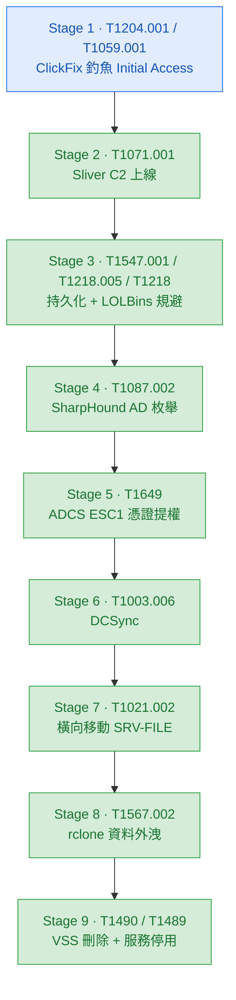

# chain-02-clickfix-to-ransomware

## 項目概述

模擬 2025–2026 年勒索軟體攻擊團夥最常見的入侵路徑，從 ClickFix 社交工程釣魚取得初始存取，建立 Sliver C2 通道，濫用 AD CS ESC1 憑證服務設定錯誤取得網域控制權，橫向移動至檔案伺服器竊取資料，最終執行勒索式破壞。

## 攻擊流程

ClickFix 釣魚 → Sliver C2 → LOLBins 規避 → SharpHound 枚舉 → ADCS ESC1 → DCSync → 橫向 SRV-FILE → rclone 外洩 → VSS 刪除 → 勒索破壞

## 攻擊鏈流程圖

**圖例:**
- 🟢 **已驗證**（綠色）— 攻擊執行 + Sentinel 命中 KQL 規則
- 🔘 **概念設計**（灰色虛線）— 攻擊成功，偵測邏輯待補
- 🔵 **被攔截**（藍色）— EDR 阻擋攻擊

---

## 項目成果

| 階段 | 技術 | 狀態 | 說明 | KQL 規則 |
|---|---|---|---|---|
| Stage 1 | T1204.001 - ClickFix 使用者執行 | 🔵 攔截 | MDE AMSI 阻擋 PowerShell shellcode loader；Defender 偵測 demon.exe 下載；最終透過 Exclusion Path 繞過 | Endpoint - Defender - Malicious File Download Detected (T1204.001) |
| Stage 1 | T1059.001 - PowerShell 可疑執行 | 🔘 概念 | 標準 ClickFix 路徑（explorer.exe → powershell.exe）因 AMSI 阻擋未觸發，改用手動執行 | Endpoint - PowerShell - Suspicious Command Execution via Run Dialog (T1059.001) |
| Stage 1 | T1059.001 - AMSI 偵測 | ✅ 驗證 | MDE AMSI 掃描並阻擋 shellcode loader 內容，偵測訊號已驗證 | Endpoint - Defender - AMSI Malicious Script Blocked (T1059.001) |
| Stage 2 | T1071.001 - Sliver C2 上線 | ✅ 驗證 | demon.exe 從 C:\Users\Public\ 對外建立 HTTPS beacon 回連 172.188.32.246:443 | Endpoint - Network - C2 Beacon from User Directory (T1071.001) |
| Stage 3 | T1547.001 - Registry Run Key 持久化 | ✅ 驗證 | 透過 C2 shell 寫入 HKCU Run Key，alice 登入自動執行 demon.exe | Endpoint - Registry - Run Key Persistence (T1547.001) |
| Stage 3 | T1218.005 - mshta LOLBin | ✅ 驗證 | 透過 C2 執行 mshta.exe 載入遠端 HTA，產生 LOLBin 對外連線訊號 | Endpoint - mshta - Remote HTA Network Connection (T1218.005) |
| Stage 3 | T1218 - LOLBin 綜合 | ✅ 驗證 | 偵測多種 LOLBin 帶網路參數執行，偵測訊號已驗證 | Endpoint - LOLBin - Suspicious Process with Network Parameters (T1218) |
| Stage 4 | T1087.002 - SharpHound AD 枚舉 | ✅ 驗證 | SharpHound v2.13.0 執行全域 AD 枚舉（347 個物件），偵測訊號已驗證 | AD - SharpHound - Enumeration Tool Execution (T1087.002) |
| Stage 5 | T1649 - ADCS ESC1 憑證申請 | ✅ 驗證 | alice 申請 SAN=admin@corp.lab 憑證（Requester ≠ Principal Name），4887 事件已驗證 | AD - ADCS - ESC1 Certificate Request with Enrollee Supplied Subject (T1649) |
| Stage 6 | T1003.006 - DCSync | ✅ 驗證 | 以 admin NT hash 執行 DCSync，取得全域憑證，4662 事件已驗證 | AD - DomainObject - Directory Replication by Non-DC Account (T1003.006) |
| Stage 7 | T1021.002 - 橫向移動 SRV-FILE | ✅ 驗證 | smbclient 使用 admin Kerberos TGT 存取 SRV-FILE C$，成功列舉 FinanceShare | AD - SMB - Lateral Movement to File Server via Admin Share (T1021.002) |
| Stage 8 | T1567.002 - rclone 外洩 | ✅ 驗證 | rclone 嘗試連線至 MinIO（含 ConnectionFailed 訊號），3 個檔案外洩至 stolen-data | Endpoint - Network - Large Outbound Transfer to Non-Corporate Endpoint (T1567.002) |
| Stage 9 | T1490 - VSS 刪除 | ✅ 驗證 | vssadmin delete shadows 在 SRV-FILE 執行，DeviceProcessEvents 偵測訊號已驗證 | Endpoint - VSS - Shadow Copy Deletion (T1490) |
| Stage 9 | T1489 - 服務停用 | ✅ 驗證 | net stop VSS 在 SRV-FILE 執行，DeviceProcessEvents 偵測訊號已驗證 | Endpoint - Service - Backup and Database Service Stopped (T1489) |

## 未覆蓋階段

以下階段目前無 KQL 規則：

**Stage 1（T1059.001 - PowerShell via Run Dialog）**

缺口：MDE AMSI 成功阻擋標準 ClickFix PowerShell 載入方式（包含字串混淆、char array 混淆版本），標準執行路徑（explorer.exe → powershell.exe）在本 lab 環境中未觸發。若補齊環境，偵測邏輯如下：以 DeviceProcessEvents 監控 `FileName = powershell.exe` 且 `InitiatingProcessFileName = explorer.exe` 且 CommandLine 含 IEX/DownloadString 的組合——使用者從 Run 對話框直接執行含下載行為的 PowerShell，正常使用者幾乎不會觸發，FP 率極低。

**T1486 - 副檔名修改（勒索加密）**

缺口：SRV-FILE 的 MDE 於本攻擊執行後才完成 onboard，FileRenamed 事件無歷史資料可查；重新執行改名後 DeviceFileEvents 仍未記錄到 FileRenamed，推測為 MDE 對 SRV-FILE 本機 PowerShell Rename-Item 操作的覆蓋限制。規則邏輯正確，在完整 MDE 覆蓋的環境下有效。

## Stage 1 補充說明：MDE 阻擋與繞過

**初始狀況**：MDE 在 Initial Access 階段展現多層防禦：
- AMSI 阻擋所有 PowerShell shellcode loader（包含字串混淆、char array 混淆版本）
- Defender 的網路層掃描在檔案落地前就偵測並隔離 demon.exe
- mshta + VBScript 載體同樣被 AMSI 攔截

**繞過方式**：透過 labadmin 在 employee01 設定 Defender Exclusion Path（`C:\Users\Public\`），並加入 MDE Indicator 白名單，讓 demon.exe 在排除路徑下執行不觸發檔案掃描。MDE 的網路行為偵測與程序行為分析仍持續運作，C2 beacon 流量與 LOLBin 行為均產生偵測訊號。

**影響範圍**：Initial Access 的「使用者被社交工程騙執行惡意程式」這個攻擊場景已完整模擬（alice 帳號執行 demon.exe，C2 以 CORP\Alice 身份上線）；但繞過 Defender 的手法為管理員手動設定 Exclusion，而非攻擊者自主繞過，此為執行上的斷點。
