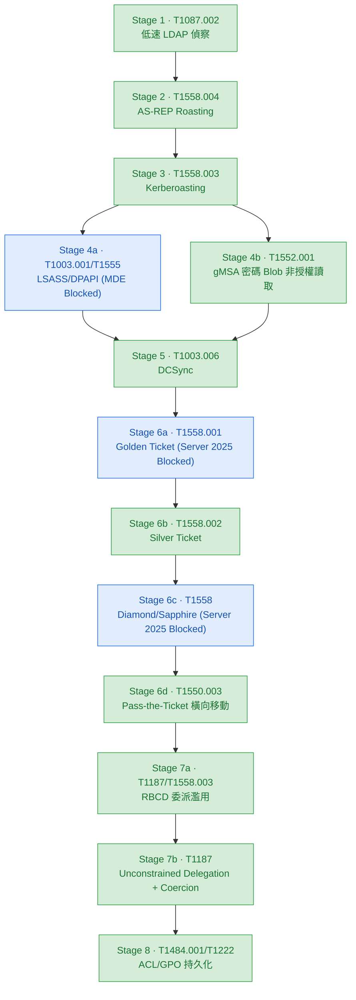

# chain-03-kerberos-lotl

## 項目概述

Kerberos 票證濫用與 LOTL 三層偵測深化鏈。前兩條攻擊鏈證明「攻擊可被偵測」，本鏈聚焦「偵測的縱深」——每項技術設計三層偵測（工具簽章層 / API 原語層 / 行為結果層），證明當任一層被繞過時仍有下一層觸發。

本鏈同時覆蓋三個實務延伸面向：gMSA 密碼 Blob 非授權讀取（LSASS 被攔截後的替代憑證竊取路徑）、Pass-the-Ticket 橫向移動（票證鍛造的完整使用鏈）、Unconstrained Delegation（委派濫用的第二條攻擊路徑）。

## 攻擊流程

低速 LDAP 偵察 → AS-REP Roasting → Kerberoasting → LSASS Blocked / gMSA 非授權讀取 → DCSync → 票證鍛造（Golden/Silver/Diamond/Sapphire）+ Pass-the-Ticket 橫向 → RBCD + Unconstrained Delegation 委派濫用 → ACL/GPO 持久化

## 攻擊鏈流程圖

**圖例:**
- 🟢 **已驗證**(綠色) — 攻擊執行 + Sentinel 命中 KQL 規則
- 🔘 **概念設計**(灰色虛線) — 攻擊成功或邏輯設計完成,偵測待補
- 🔵 **被攔截**(藍色) — EDR 或環境防護阻擋攻擊

---

## 三層偵測方法論

| 層級 | 偵測依據 | 韌性 | 被繞過條件 |
|---|---|---|---|
| 工具簽章層 | 已知攻擊工具命令列特徵 | 最低 | 換工具、改名、LOTL |
| API 原語層 | 協定/API 本質行為(4768/4769/4662/5136) | 中 | 低速、AES 降級規避 |
| 行為結果層 | 跨事件因果落差(索票無登入、TGS 無 AS-REQ) | 最高 | 極難規避(需消除因果痕跡) |

---

## 環境校準紀錄

| 校準項目 | 初始假設 | 實測結果 | 修正 |
|---|---|---|---|
| Stage 1 ObjectType 門檻 | DistinctObjectTypes >= 5 | 完整枚舉只產生 3 種 | 改為 >= 3 |
| Stage 2/3 加密類型 | TicketEncryptionType == "0x17" RC4 | DC 強制 AES 回 0x12，RC4 請求報 KDC_ERR_ETYPE_NOSUPP | 移除 enctype 限定 |
| Stage 2/3 欄位解析 | 直接用欄位名(PreAuthType 等) | 4768/4769 欄位未被 DCR 原生解析，藏在 EventData XML | 全面改用 extract() |
| Stage 6a Golden Ticket | 偽造 TGT 可用 | Windows Server 2025 多層 PAC 驗證，六種方式均被拒 | 標記環境限制，改偵測失敗嘗試 |
| Stage 7a 5136 稽核 | RBCD 寫入觸發 5136 | DC 本機不產生 5136，即使設 SACL | 原因未確認，標概念設計 |

---

## 項目成果

| 階段 | 技術 | 狀態 | 說明 | KQL 規則 | 新/舊 |
|---|---|---|---|---|---|
| Stage 1 | T1087.002 低速 LDAP 偵察 | ✅ 驗證 | DirectorySearcher LOTL；門檻校準 >=3；AccessMask 0x10；CORP\\ filter 排除 labadmin FP | AD - Recon - Anomalous LDAP Object Enumeration AD - Recon - Low-and-Slow LDAP Enumeration | 🆕 |
| Stage 2 | T1558.004 AS-REP Roasting | ✅ 驗證 | 3 個 svc-legacy 帳號；EventData extract()；DC 回 AES256(0x12)；批次收割行為層(TargetedAccounts=3) | AD - KDC - AS-REP Roasting Pre-Auth Disabled AD - KDC - AS-REP Roasting Bulk Harvesting | 🆕 全新技術 |
| Stage 3 | T1558.003 Kerberoasting | ✅ 驗證 | AES hash 得手；ServiceName vs 4624 leftanti join(版本B)；RoastedNoLogon=6(含格式重複) | AD - KDC - Kerberoasting TGS Requests(沿用) AD - KDC - Kerberoasting Multi-SPN Harvesting AD - KDC - Kerberoast Ticket Without Logon | ♻️ 原語層沿用 ⬆️🆕 升級+新增 |
| Stage 4a | T1003.001/T1555 LSASS/DPAPI | 🔵 攔截 | comsvcs MiniDump 被 MDE HackTool:Win32/DumpLsass.H 攔截；EMPLOYEE01 和 DC01 均無法執行 | Endpoint - LSASS - Suspicious Process Access Endpoint - LSASS - Credential Dump via comsvcs MiniDump Endpoint - DPAPI - Masterkey File Access | 🆕(概念設計) |
| Stage 4b | T1552.001 gMSA 密碼 Blob | ✅ 驗證 | netexec --gmsa Alice 非授權讀取被拒；DC01 產生 4662（Subject=alice，AccessMask=0x10，35筆）；Sentinel KQL 待最終確認 | AD - gMSA - Unauthorized ManagedPassword Attribute Access | 🆕 |
| Stage 5 | T1003.006 DCSync | ✅ 驗證 | svc_backup 執行；AccessMask 0x100 確認；行為層關聯 4769(SrcIp filter 收斂噪音) | AD - DomainObject - Directory Replication by Non-DC Account(沿用) AD - DCSync Followed by Anomalous KRBTGT Activity | ♻️ 沿用原語層 🆕 行為層 |
| Stage 6a | T1558.001 Golden Ticket | 🔵 環境限制 | Windows Server 2025 PAC 驗證；六種方式均被 KDC_ERR_TGT_REVOKED 拒絕；失敗不留標準 Security Event | AD - Kerberos - Golden Ticket TGS Without AS-REQ(概念) AD - Kerberos - Anomalous Ticket Lifetime(概念) AD - Kerberos - Golden Ticket Attempt Rejected(失敗偵測) | 🆕(概念+失敗偵測) |
| Stage 6b | T1558.002 Silver Ticket | ✅ 驗證 | cifs/SRV-FILE；存取 C$/FinanceShare/HRShare；SRV-FILE 4624 有但 DC 4769 無 | AD - Kerberos - Silver Ticket Service Access Without DC Log | 🆕 全新技術 |
| Stage 6c | T1558 Diamond/Sapphire | 🔵 環境限制 | Windows Server 2025 PAC 驗證同樣擋住 Diamond；PAC 內容合法極難偵測 | AD - Kerberos - PAC Privilege Anomaly(輔助偵測) | 🆕(概念設計) |
| Stage 6d | T1550.003 Pass-the-Ticket | ⚠️ 部分 | Silver Ticket 存取 C$/FinanceShare/HRShare 成功；遠端執行(atexec/smbexec/psexec)受 cifs SPN 限制 | AD - Pass-the-Ticket - Anomalous Kerberos Logon AD - Pass-the-Ticket - Forged TGT Lateral Movement Behavioral | 🆕 全新技術 |
| Stage 7a | T1187/RBCD | ⚠️ 部分 | msDS-AllowedToActOnBehalfOfOtherIdentity 寫入成功；S4U2Self 被 Server 2025 Protocol Transition 限制；5136 DC 本機不產生 | AD - Delegation - RBCD Attribute Modification AD - Coerced Authentication Anomaly | 🆕(寫入驗證，S4U概念) |
| Stage 7b | T1187 Unconstrained Delegation | ✅ 驗證 | PetitPotam Attack worked!；Responder 捕獲 DC01$ NTLMv2 hash；MDE DeviceNetworkEvents dc01→10.0.4.4:445 Sentinel 通過；TGT 擷取標概念設計（MDE 限制） | AD - Coerced Authentication - DC Outbound SMB to Non-DC Host | 🆕 |
| Stage 8 | T1484.001/T1222 ACL/GPO | ⚠️ 部分 | ACL 寫入成功，5136 Sentinel 通過（labadmin 本機）；GPO SYSVOL 寫入成功（ScheduledTasks.xml/scripts.ini/GPT.INI）；Windows 11 CSE 不觸發下游執行 | AD - ACL - GenericAll DACL Grant on Container AD - GPO - Unauthorized Group Policy Modification AD - GPO Abuse to Endpoint Execution | 🆕 |

---

## KQL 規則總覽（22 條）

### TA0007-discovery（2 條）
| 規則 | 層級 | 狀態 |
|---|---|---|
| AD - Recon - Anomalous LDAP Object Enumeration (T1087.002) | 原語層 | ✅ |
| AD - Recon - Low-and-Slow LDAP Enumeration (T1087.002) | 行為層 | ✅(概念驗證) |

### TA0006-credential-access（13 條）
| 規則 | 層級 | 狀態 |
|---|---|---|
| AD - KDC - AS-REP Roasting Pre-Auth Disabled (T1558.004) | 原語層 | ✅ |
| AD - KDC - AS-REP Roasting Bulk Harvesting (T1558.004) | 行為層 | ✅ |
| AD - KDC - Kerberoasting Multi-SPN Harvesting (T1558.003) | 原語層升級 | ✅ |
| AD - KDC - Kerberoast Ticket Without Logon (T1558.003) | 行為層 | ✅ |
| Endpoint - LSASS - Suspicious Process Access (T1003.001) | 原語層(MDE) | 🔘 概念 |
| Endpoint - LSASS - Credential Dump via comsvcs MiniDump (T1003.001) | 行為層(MDE) | 🔘 概念 |
| Endpoint - DPAPI - Masterkey File Access (T1555) | 原語層(MDE) | 🔘 概念 |
| AD - DCSync Followed by Anomalous KRBTGT Activity (T1003.006) | 行為層 | ✅ |
| AD - Kerberos - Golden Ticket TGS Without AS-REQ (T1558.001) | 行為層 | 🔘 概念(攻擊被擋) |
| AD - Kerberos - Anomalous Ticket Lifetime (T1558.001) | 行為層 | 🔘 概念 |
| AD - Kerberos - Golden Ticket Attempt Rejected (T1558.001) | 失敗偵測 | 🔘 概念(DC 不產生失敗事件) |
| AD - Kerberos - Silver Ticket Service Access Without DC Log (T1558.002) | 行為層 | ✅ |
| AD - Kerberos - PAC Privilege Anomaly Diamond Sapphire (T1558) | 輔助偵測 | 🔘 概念 |

### TA0008-Lateral-Movement（4 條）
| 規則 | 層級 | 狀態 |
|---|---|---|
| AD - Delegation - RBCD Attribute Modification (T1558.003) | 原語層 | 🔘 5136不產生 |
| AD - Coerced Authentication Anomaly (T1187) | 行為層 | 🔘 概念 |
| AD - Pass-the-Ticket - Anomalous Kerberos Logon (T1550.003) | 原語層 | ✅ |
| AD - Pass-the-Ticket - Forged TGT Lateral Movement Behavioral (T1550.003) | 行為層 | ✅ |

### TA0003-Persistence（2 條）
| 規則 | 層級 | 狀態 |
|---|---|---|
| AD - GPO - Unauthorized Group Policy Modification (T1484.001) | 原語層 | 🔲 待驗證 |
| AD - GPO Abuse to Endpoint Execution (T1484.001) | 行為層 | 🔲 待驗證 |

### TA0112-Defense-Impairment（1 條）
| 規則 | 層級 | 狀態 |
|---|---|---|
| AD - ACL - GenericAll DACL Grant on Container (T1222) | 原語層 | 🔲 待驗證 |

---

## 未覆蓋 / 部分覆蓋階段

**Stage 4a：LSASS/DPAPI — 🔵 MDE 攔截**
comsvcs MiniDump 被 MDE（HackTool:Win32/DumpLsass.H）在 rundll32 層級阻止，EMPLOYEE01 和 DC01 均無法執行。MDE 的攔截本身是工具簽章層防禦有效的展示，與 Stage 1 LOTL 讓工具簽章層失效形成對比。Stage 4b（gMSA）為替代路徑。

**Stage 6a Golden Ticket — 🔵 Server 2025 環境限制**
Windows Server 2025 開啟多層 Kerberos PAC 驗證，impacket v0.14.0 的六種方式（NTLM hash / AES256 / Diamond -request / Diamond -extra-pac / RID 500指定 / KdcPacRequestorEnforcement=0）均被 KDC_ERR_TGT_REVOKED 拒絕。失敗不留標準 Security Event 4768（DC 在協定層拒絕，不寫 Event Log）。Silver Ticket 仍有效，證明服務主機保護弱於 DC。

**Stage 6c Diamond/Sapphire — 🔵 同上 + 🔘 業界公認難偵測**
Diamond/Sapphire 的 PAC 內容看似合法，即使攻擊成功，標準 SIEM 日誌也只能輔助偵測。完整偵測需 PAC 深度解析能力，超出標準日誌範圍。

**Stage 7a S4U2Self — 🔵 Server 2025 Protocol Transition 限制**
RBCD 屬性寫入成功，但 S4U2Self 被 Server 2025 的 Protocol Transition 限制擋住（KDC_ERR_C_PRINCIPAL_UNKNOWN）。5136 DC 本機不產生，即使設 SACL 和啟用 Directory Service Changes 稽核，原因未確認。

**Stage 7b Unconstrained Delegation**
EMPLOYEE01 已設 TrustedForDelegation，強制驗證（PetitPotam）待執行。TGT 擷取需要 Rubeus/Mimikatz，但 MDE 會攔截，需 Exclusion Path 或其他繞過方式。

**Stage 4b：gMSA 密碼 Blob — ✅ 執行完成**
netexec --gmsa 以 Alice 非授權讀取 svc-gmsa-lab 的 msDS-ManagedPassword，DC 拒絕（no read permissions），4662 在 DC01 本機產生 35 筆，Subject=alice，AccessMask=0x10。Sentinel KQL 驗證為最後一步（對話結束前未完成查詢）。

**Stage 7b：Unconstrained Delegation — ✅ 執行完成**
PetitPotam 強制 DC01 對 Kali（10.0.5.4）做 NTLM 認證，Responder 捕獲 DC01$ NTLMv2 hash，Attack worked! 確認。MDE DeviceNetworkEvents 偵測到 dc01.corp.lab→10.0.4.4:445，Sentinel 驗證通過。TGT 擷取需 Rubeus/Mimikatz，因 MDE 限制標概念設計。

**Stage 8：ACL/GPO — ⚠️ 部分完成**
ACL 寫入：DC01 本機 PowerShell Set-Acl 觸發 5136，Sentinel 通過；impacket-dacledit 遠端寫入 SubjectUser 顯示 labadmin 非 Alice。
GPO 寫入：SYSVOL 所有檔案上傳成功（ScheduledTasks.xml、test.bat、scripts.ini、GPT.INI）。
下游執行：Windows 11 CSE 在手動寫 SYSVOL 時不觸發 Immediate Task 和 Startup Script，即使 GPT.INI 正確加入 CSE GUID、重開機後仍未執行。標記環境限制。

---

## Stage 6 補充說明：票證鍛造的偵測難度光譜

| 票種 | 偵測邏輯 | 你的環境 |
|---|---|---|
| Golden Ticket | TGS 無 AS-REQ 因果缺失（行為層） | 🔵 攻擊被擋，無遙測，失敗不留 Event |
| Silver Ticket | 服務有 4624 但 DC 無 4769（行為層） | ✅ 驗證通過 |
| Diamond Ticket | AS-REQ 帳號 ≠ TGS 帳號（跨事件比對） | 🔵 同 Golden，被擋 |
| Sapphire Ticket | S4U2Self 模擬高權限帳號（Transited Services 非空） | 🔵 同上 |

**核心洞察**：防禦加固改變偵測策略。未加固環境靠「因果落差」偵測成功的 Golden Ticket；Server 2025 環境攻擊嘗試本身就是訊號，但失敗事件又不留標準 Event Log——這個「防禦有效但偵測訊號也消失」的矛盾，是現代 AD 加固的真實困境。

---

## Chain 3 最終狀態

所有 Stage 均已執行完畢。未完成項目：
1. Stage 4b Sentinel KQL 最終確認（4662 有在 DC01，等 ingestion 後跑查詢）
2. Stage 8 下游執行（Windows 11 CSE 問題，手動 SYSVOL 寫入不觸發）
3. detection-design.md 完整撰寫（方法論、校準案例、環境發現）
