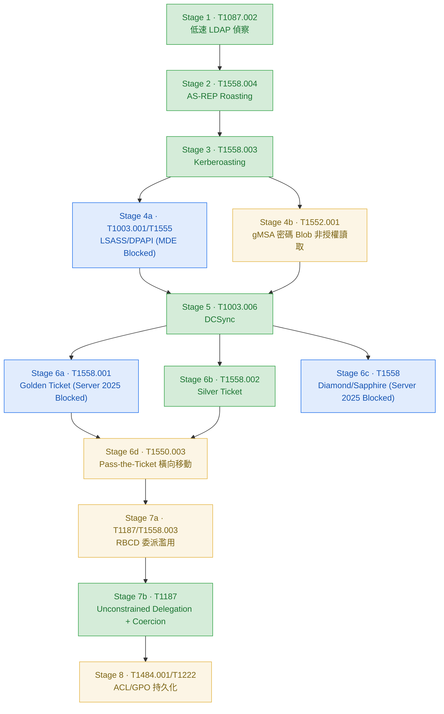

# chain-03-kerberos-lotl

## 項目概述

Kerberos 票證濫用與 LOTL 三層偵測深化鏈。前兩條攻擊鏈證明「攻擊可被偵測」，本鏈聚焦「偵測的縱深」——每項技術設計三層偵測（工具簽章層 / API 原語層 / 行為結果層），證明當任一層被繞過時仍有下一層觸發。

本鏈同時覆蓋三個實務延伸面向：gMSA 密碼 Blob 非授權讀取（LSASS 被攔截後的替代憑證竊取路徑）、Pass-the-Ticket 橫向移動（票證鍛造的完整使用鏈）、Unconstrained Delegation（委派濫用的第二條攻擊路徑）。

## 攻擊流程

低速 LDAP 偵察 → AS-REP Roasting → Kerberoasting → LSASS Blocked / gMSA 非授權讀取 → DCSync → 票證鍛造（Golden/Silver/Diamond/Sapphire）+ Pass-the-Ticket 橫向 → RBCD + Unconstrained Delegation 委派濫用 → ACL/GPO 持久化

## 攻擊鏈流程圖

**圖例:**
- 🟢 **已驗證**（綠色）— 攻擊執行 + Sentinel 命中 KQL 規則
- 🟡 **部分**（黃色）— 攻擊成功但偵測有限制或 Sentinel 未完整驗證
- 🔘 **概念設計**（灰色虛線）— 攻擊成功或邏輯設計完成，偵測待補
- 🔵 **被攔截**（藍色）— EDR 或環境防護阻擋攻擊

---

## 三層偵測方法論

| 層級 | 偵測依據 | 韌性 | 被繞過條件 |
|---|---|---|---|
| 工具簽章層 | 已知攻擊工具命令列特徵 | 最低 | 換工具、改名、LOTL |
| 原語層 | 協定/API 本質行為（4768/4769/4662/5136） | 中 | 低速、AES 降級規避 |
| 行為結果層 | 跨事件因果落差（索票無登入、TGS 無 AS-REQ） | 最高 | 極難規避（需消除因果痕跡） |

---

## 環境校準紀錄

| 校準項目 | 初始假設 | 實測結果 | 修正 |
|---|---|---|---|
| Stage 1 ObjectType 門檻 | DistinctObjectTypes >= 5 | 完整枚舉只產生 3 種 | 改為 >= 3 |
| Stage 2/3 加密類型 | TicketEncryptionType == "0x17" RC4 | DC 強制 AES 回 0x12，RC4 請求報 KDC_ERR_ETYPE_NOSUPP | 移除 enctype 限定 |
| Stage 2/3 欄位解析 | 直接用欄位名（PreAuthType 等） | 4768/4769 欄位未被 DCR 原生解析，藏在 EventData XML | 全面改用 extract() |
| Stage 5 AccessMask | 0x40000（通用文件） | 環境實測 0x100 | 修正 |
| Stage 6a Golden Ticket | 偽造 TGT 可用 | Windows Server 2025 多層 PAC 驗證，六種方式均被拒 | 標記環境限制 |
| Stage 7a 5136 稽核 | RBCD 寫入觸發 5136 | DC 本機不產生 5136，impacket LDAP channel 問題 | 標概念設計 |
| Stage 8 GPO 路徑 | 5136 偵測 GPO 修改（路徑A） | 攻擊走路徑B（直接寫 SYSVOL），5136 不產生 | 改用 DeviceFileEvents |

---

## 項目成果

| Stage | 技術 | 狀態 | 說明 | KQL 規則 |
|---|---|---|---|---|
| Stage 1 | T1087.002 低速 LDAP 偵察 | ✅ 驗證 | DirectorySearcher LOTL；門檻校準 >=3；AccessMask 0x10 | AD - Recon - Anomalous LDAP Object Enumeration AD - Recon - Low-and-Slow LDAP Enumeration |
| Stage 2 | T1558.004 AS-REP Roasting | ✅ 驗證 | 3 個 svc-legacy 帳號；EventData extract()；DC 回 AES256(0x12) | AD - KDC - AS-REP Roasting Pre-Auth Disabled AD - KDC - AS-REP Roasting Bulk Harvesting |
| Stage 3 | T1558.003 Kerberoasting | ✅ 驗證 | AES hash 得手；Multi-SPN 聚合；SPNSet 內容判斷 | AD - KDC - Kerberoasting Multi-SPN Harvesting |
| Stage 4a | T1003.001/T1555 LSASS/DPAPI | 🔵 攔截 | comsvcs MiniDump 被 MDE HackTool:Win32/DumpLsass.H 攔截 | Endpoint - LSASS - Suspicious Process Access Endpoint - LSASS - Credential Dump via comsvcs MiniDump Endpoint - DPAPI - Masterkey File Access |
| Stage 4b | T1552.001 gMSA 密碼 Blob | ⚠️ 部分 | netexec --gmsa Alice 非授權讀取被拒；DC01 產生 4662 35 筆；Sentinel KQL 待補跑 | AD - gMSA - Unauthorized ManagedPassword Attribute Access |
| Stage 5 | T1003.006 DCSync | ✅ 驗證 | svc_backup 執行；AccessMask 0x100 確認；行為層關聯 4769 | AD - DomainObject - Directory Replication by Non-DC Account AD - DCSync Followed by Anomalous KRBTGT Activity |
| Stage 6a | T1558.001 Golden Ticket | 🔵 環境限制 | Windows Server 2025 PAC 驗證；六種方式均被 KDC_ERR_TGT_REVOKED 拒絕 | AD - Kerberos - Golden Ticket TGS Without AS-REQ（概念） AD - Kerberos - Anomalous Ticket Lifetime（概念） AD - Kerberos - Golden Ticket Attempt Rejected（概念） |
| Stage 6b | T1558.002 Silver Ticket | ✅ 驗證 | cifs/SRV-FILE；存取 C$/FinanceShare/HRShare；SRV-FILE 4624 有但 DC 4769 無 | AD - Kerberos - Silver Ticket Service Access Without DC Log |
| Stage 6c | T1558 Diamond/Sapphire | 🔵 環境限制 | Windows Server 2025 PAC 驗證同樣擋住 Diamond | AD - Kerberos - PAC Privilege Anomaly（概念） |
| Stage 6d | T1550.003 Pass-the-Ticket | ⚠️ 部分 | Silver Ticket 存取 C$/FinanceShare/HRShare 成功；遠端執行受 cifs SPN 限制 | AD - Pass-the-Ticket - Forged TGT Lateral Movement Behavioral |
| Stage 7a | T1187/RBCD | ⚠️ 部分 | msDS-AllowedToActOnBehalfOfOtherIdentity 寫入成功；S4U 被 Server 2025 擋；5136 不產生 | AD - Delegation - RBCD Attribute Modification（概念） |
| Stage 7b | T1187 Unconstrained Delegation | ✅ 驗證 | PetitPotam Attack worked!；Responder 捕獲 DC01$ NTLMv2 hash；MDE DeviceNetworkEvents 驗證 | AD - Coerced Authentication - DC Outbound SMB |
| Stage 8 | T1484.001/T1222 ACL/GPO | ⚠️ 部分 | ACL 寫入 5136 Sentinel 通過；GPO SYSVOL 寫入成功；下游執行 Windows 11 CSE 不觸發 | AD - ACL - GenericAll DACL Grant on Container AD - GPO - Unauthorized Group Policy Modification（概念） AD - GPO Abuse to Endpoint Execution（概念） |

---

## KQL 規則總覽

### TA0007-discovery（2 條）
| 規則 | 層級 | 狀態 |
|---|---|---|
| AD - Recon - Anomalous LDAP Object Enumeration (T1087.002) | 原語層 | ✅ |
| AD - Recon - Low-and-Slow LDAP Enumeration (T1087.002) | 行為層 | ✅ 概念驗證 |

### TA0006-credential-access（14 條）
| 規則 | 層級 | 狀態 |
|---|---|---|
| AD - KDC - AS-REP Roasting Pre-Auth Disabled (T1558.004) | 原語層 | ✅ |
| AD - KDC - AS-REP Roasting Bulk Harvesting (T1558.004) | 行為層 | ✅ |
| AD - KDC - Kerberoasting Multi-SPN Harvesting (T1558.003) | 原語層升級 | ✅ |
| AD - KDC - Kerberoast Ticket Without Logon (T1558.003) | 行為層 | 🔘 不建議生產部署（兩個根本限制） |
| Endpoint - LSASS - Suspicious Process Access (T1003.001) | 原語層(MDE) | 🔘 概念 |
| Endpoint - LSASS - Credential Dump via comsvcs MiniDump (T1003.001) | 行為層(MDE) | 🔘 概念 |
| Endpoint - DPAPI - Masterkey File Access (T1555) | 原語層(MDE) | 🔘 概念 |
| AD - DomainObject - Directory Replication by Non-DC Account (T1003.006) | 原語層 | ✅ |
| AD - DCSync Followed by Anomalous KRBTGT Activity (T1003.006) | 行為層 | ✅ |
| AD - Kerberos - Golden Ticket TGS Without AS-REQ (T1558.001) | 行為層 | 🔘 概念（票證快取 FP 問題） |
| AD - Kerberos - Anomalous Ticket Lifetime (T1558.001) | 行為層 | 🔘 概念（DCR 未解析欄位） |
| AD - Kerberos - Golden Ticket Attempt Rejected (T1558.001) | 失敗偵測 | 🔘 概念（DC 不產生失敗事件） |
| AD - Kerberos - Silver Ticket Service Access Without DC Log (T1558.002) | 行為層 | ✅ |
| AD - Kerberos - PAC Privilege Anomaly Diamond Sapphire (T1558) | 輔助偵測 | 🔘 概念 |
| AD - gMSA - Unauthorized ManagedPassword Attribute Access (T1552.001) | 原語層 | ⚠️ DC 本機確認，Sentinel 待補跑 |

### TA0008-Lateral-Movement（3 條）
| 規則 | 層級 | 狀態 |
|---|---|---|
| AD - Delegation - RBCD Attribute Modification (T1558.003) | 原語層 | 🔘 5136 不產生 |
| AD - Coerced Authentication - DC Outbound SMB (T1187) | 行為層 | ✅ |
| AD - Pass-the-Ticket - Forged TGT Lateral Movement Behavioral (T1550.003) | 行為層 | 🔘 環境規模限制未驗證 |

### TA0003-Persistence（2 條）
| 規則 | 層級 | 狀態 |
|---|---|---|
| AD - GPO - Unauthorized Group Policy Modification (T1484.001) | 原語層(路徑B) | 🔘 概念，待補跑 DeviceFileEvents |
| AD - GPO Abuse to Endpoint Execution (T1484.001) | 行為層 | 🔘 概念，下游執行未觸發 |

### TA0112-Defense-Impairment（1 條）
| 規則 | 層級 | 狀態 |
|---|---|---|
| AD - ACL - GenericAll DACL Grant on Container (T1222) | 原語層 | ✅ 本機操作驗證 |

---

## 環境限制說明

**Stage 6a/6c Golden/Diamond/Sapphire — 🔵 Server 2025 PAC 驗證**
Windows Server 2025 開啟多層 Kerberos PAC 驗證，impacket v0.14.0 六種方式均被 KDC_ERR_TGT_REVOKED 拒絕。失敗不留 Security Event。Silver Ticket 仍有效，證明服務主機保護弱於 DC。

**Stage 4a LSASS/DPAPI — 🔵 MDE 攔截**
comsvcs MiniDump 被 MDE（HackTool:Win32/DumpLsass.H）在 rundll32 層級阻止。MDE 的工具簽章層在這裡有效，與 Stage 1 LOTL 讓工具簽章層失效形成對比。

**Stage 7a S4U2Self — 🔵 Server 2025 Protocol Transition 限制**
RBCD 屬性寫入成功，但 S4U2Self 被 Server 2025 的 Protocol Transition 限制擋住。5136 DC 本機不產生，impacket LDAP channel 不觸發稽核事件。

**Stage 8 GPO 下游執行 — 🔘 Windows 11 CSE 問題**
SYSVOL 寫入成功（路徑B），但 Windows 11 對手動寫入 SYSVOL 的 CSE 觸發條件嚴格，Immediate Task 和 Startup Script 重開機後均未執行。偵測規則改用 DeviceFileEvents 偵測路徑B寫入。

